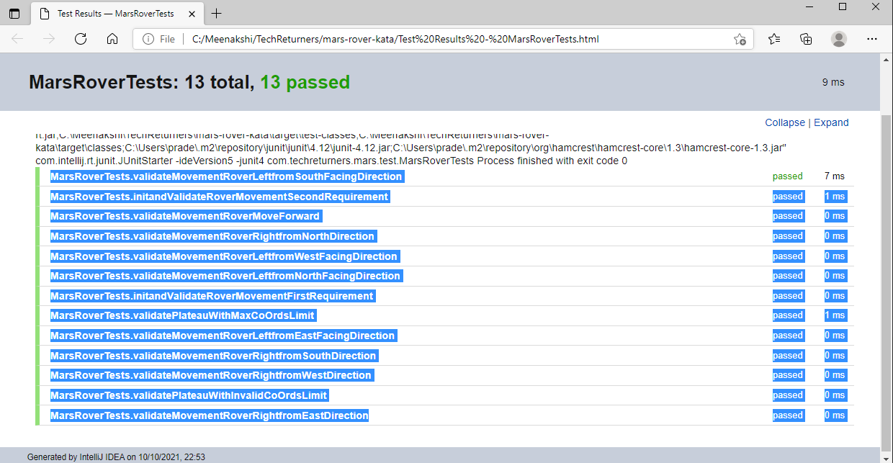

MarsRoverControl
Contains all teh function to drive the Mars rover requiremetn in kata and has a independently executable main funtion

MarRoverPos
Hols the coodinates were Mors Rover is present

Rover Class
The Rover will have his current position in x  y
and the orientation that it's facing e.g N/E/W/S.
command "execute" may change the orientation or move to next position after checking if it's free.

Plateau Class
We have the Plateau grid shapes than square/rectangle and can be represented as grid of integers

MarsRoverTests

Contains list of executables self explained tests as below

MarsRoverTests.validateMovementRoverLeftfromSouthFacingDirection
MarsRoverTests.initandValidateRoverMovementSecondRequirement
MarsRoverTests.validateMovementRoverMoveForward
MarsRoverTests.validateMovementRoverRightfromNorthDirection
MarsRoverTests.validateMovementRoverLeftfromWestFacingDirection
MarsRoverTests.validateMovementRoverLeftfromNorthFacingDirection
MarsRoverTests.initandValidateRoverMovementFirstRequirement
MarsRoverTests.validatePlateauWithMaxCoOrdsLimit
MarsRoverTests.validateMovementRoverLeftfromEastFacingDirection
MarsRoverTests.validateMovementRoverRightfromSouthDirection
MarsRoverTests.validateMovementRoverRightfromWestDirection
MarsRoverTests.validatePlateauWithInvalidCoOrdsLimit
MarsRoverTests.validateMovementRoverRightfromEastDirection

logs of tests attached 

